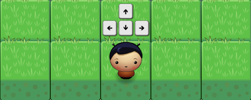

# Arcade Game Clone

## About the game
This is a tiny clone from the classic arcade game Frogger made by Konami in 1981.

The player starts at the bottom of the screen. The middle of the screen contains a road with bugs moving horizontally across it, the player must successfully move between bugs, to avoid collision. The upper of the screen consists of a river where the player reaches the goal and win the game.

## How to play it
Just open the index.html file in your favorite browser or visit the arcade game page on [eter5.github.io/arcade-game](http://eter5.github.io/arcade-game) and enjoy!

The only player control are the arrow keys from his computer, used to navigate through the game. Each press in a direction causes the player moves once in that direction.

